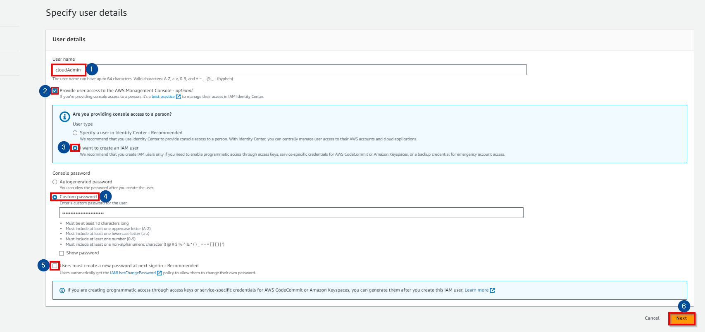
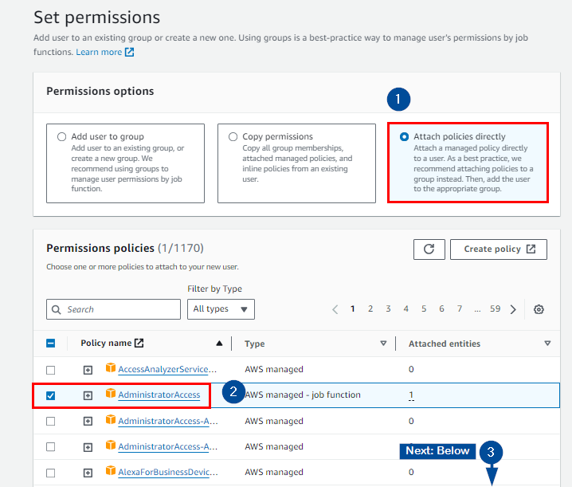
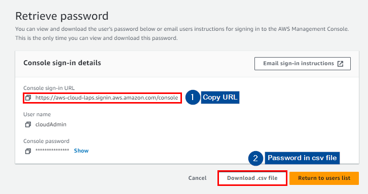
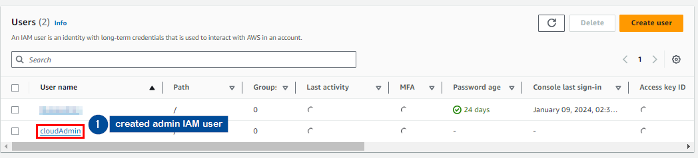
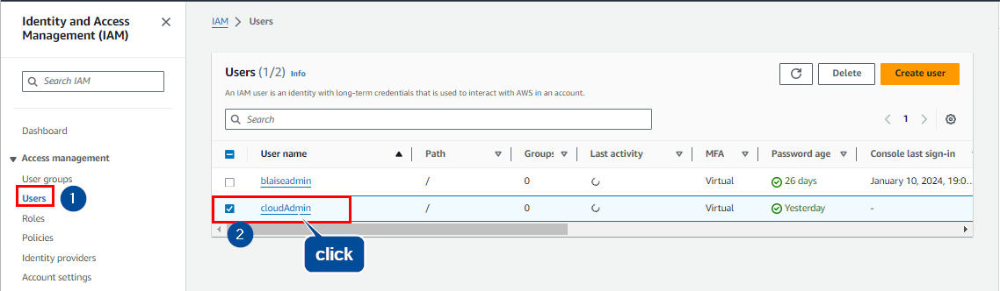
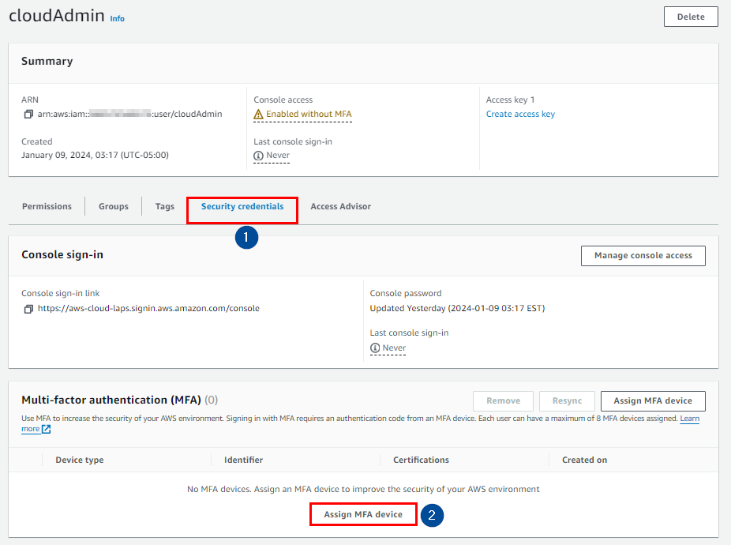
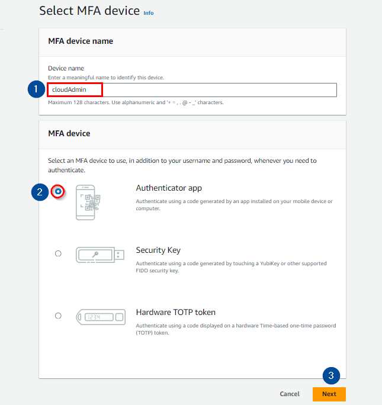
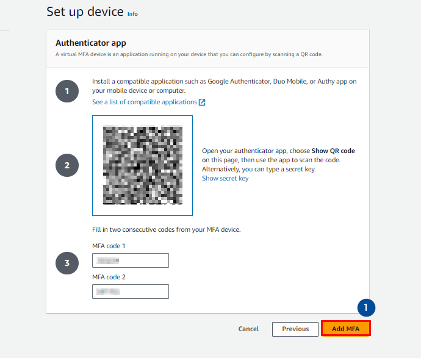
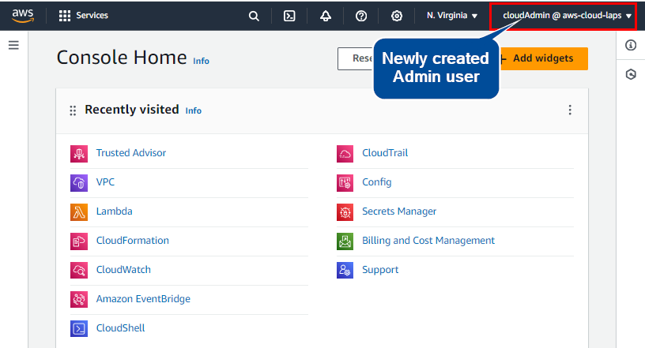

## Creating an AWS IAM User. 

## Introduction:
AWS Identity and Access Management helps organizations to securely manage identities and access to AWS services and resources. With AWS Identity and Access Management (IAM), you can specify who or what can access services and resources in AWS, centrally manage fine-grained permissions, and analyze access to refine permissions across AWS. Learn more about its benefits, and use cases at [AWS IAM](https://aws.amazon.com/iam/) 

In this step-by-step journey, we'll navigate through the process of setting up an IAM user, ensuring not only seamless resource management but also adhering to robust security practices.

## Prerequisites:
Before embarking on this AWS IAM exploration, ensure you possess an active AWS account. 
If you haven't yet ventured into the realm of AWS, [sign up](https://aws.amazon.com/premiumsupport/knowledge-center/create-and-activate-aws-account/) to initiate your journey into the cloud.

## Step 1: Create an IAM User
**1.1** Begin by logging into your AWS account using the root account credentials. Access the IAM Console from the sidebar.

**1.2** Navigate to "Users" and initiate the creation of a new user; let's name it "Administrator."

**1.3** Enable access to the AWS Management Console for the user.

**1.4** Opt for creating an IAM user, specifying a custom password that ensures both security and memorability.

**1.5** For simplicity in this lab, uncheck the "Users must create a new password" box.

**1.6** Progress to the next step.

## Step 2: Attach AdministratorAccess Policy
**2.1** Select "**Attach policies**" and opt for "**AdministratorAccess**."

**2.2** Move forward by clicking "**Next**," ensuring the addition of the "**AdministratorAccess**" AWS managed policy.

**2.3** Review your choices such as the username, password settings, permission summary, and tags, and click create user to **create** your user.

## Step 3: Copy Login URL and Verification
**3.1** After creating the user, copy the login URL provided in the format: *https://\<your_aws_account_id>.signin.aws.amazon.com/console*

Replace *\<your_aws_account_id>* with your AWS account's unique ID.

**3.2** Optionally, download the .csv file containing login information for future reference.

**3.5** Once logged in, confirm the successful creation of the IAM user "CloudAdmin."

## Step 4: Enable Multi-Factor Authentication (MFA)
Strengthen the security of your IAM user by activating Multi-Factor Authentication (MFA). [AWS multi-factor authentication (MFA)](https://docs.aws.amazon.com/IAM/latest/UserGuide/best-practices.html#enable-mfa-for-privileged-users) is an [AWS Identity and Access Management (IAM)](https://aws.amazon.com/iam/) best practice that requires a second authentication factor in addition to the user name and password sign-in credentials. You can enable MFA at the AWS account level for root and IAM users you have created in your account.  learn more about AWS available methods for IAM at [AWS MFA](https://aws.amazon.com/iam/features/mfa/)
 

**4.1** From the IAM Console, select the "**Users**" section, find the "**cloudAdmin**" user, and click on the user name.

**4.2** Navigate to the "**Security credentials**" tab and locate the "**Assigned MFA device**" section.

**4.4** Follow the prompts to set up MFA, choosing between a virtual or hardware MFA device.

**4.5** Complete the setup and enhance the security of your IAM user with an additional layer of verification.

**4.6** Log out from the root user and log in to the *cloudAdmin* user using the copied URL using the credentials downloaded, and the multifactor authentication codes generated from your authenticator device.

**Conclusion:**
By creating an IAM user with administrative privileges and activating Multi-Factor Authentication, you've not only established efficient access management but also fortified the security of your AWS resources. Stay tuned for more insights into AWS IAM to elevate your cloud security expertise. Happy cloud computing!
