## Introdoction
**Amazon EC2 Overview**
[Amazon EC2](https://docs.aws.amazon.com/AWSEC2/latest/UserGuide/concepts.html)  provides scalable computing capacity in the Amazon Web Services (AWS) Cloud. Using Amazon EC2 eliminates your need to invest in hardware up front, so you can develop and deploy applications faster. You can use Amazon EC2 to launch as many or as few virtual servers as you need, configure security and networking, and manage storage. Amazon EC2 enables you to scale up or down to handle changes in requirements or spikes in popularity, reducing your need to forecast traffic.


**Preriquisite.**
AWS account or IAM user account.


**Step 1. Create a new key pair**
In this lab, you will need to create an EC2 instance using SSH keypair. This keypair allows for a secure remote login to the EC2 instanceon port 22.The following steps outline creating a unique SSH keypair to be used in this lab.
**1.1** Sign into the AWS Management Console and open the [Amazon EC2 console](https://console.aws.amazon.com/ec2) . In the upper-right corner of the AWS Management Console, confirm you are in the desired AWS region.
**1.2** Click on **Key Pairs** in the Network & Security section near the bottom of the leftmost menu. This will display a page to manage your SSH key pairs.
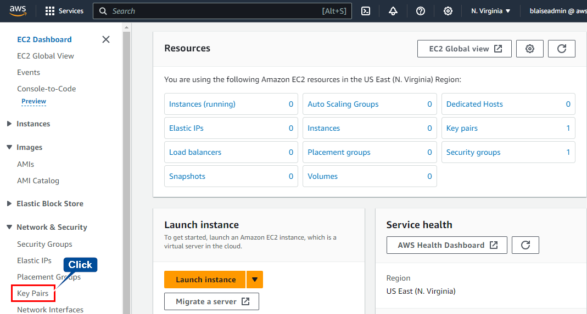
**1.3** To create a new SSH key pair, click the **create key pair** button at the top of the browser window.
**1.4** Give a name to the Key Pair Name: text box and click **Create key pair** button. For Windows users, select ppk for file format and .pem for openssh or linux users.
 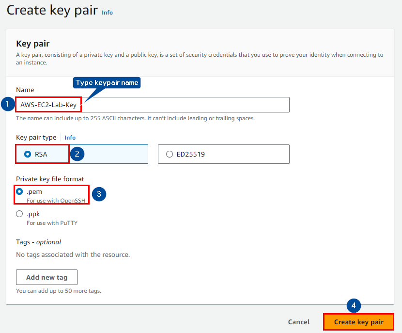
**1.5** The page will download the file [Your private key Name].pem to the local drive. Follow the browser instructions to save the file to the default download location. Remember the full path to the key pair file you just downloaded.

**Step 2. Launch a Web Server Instance.**
we will spin up an Amazon Linux 2 instance, bootstrap apache/PHP, and install a basic web page that will display information about our instance.
**2.1** Click on the **EC2 Dashboard** near the top of the leftmost menu. And click **launch Instances**.
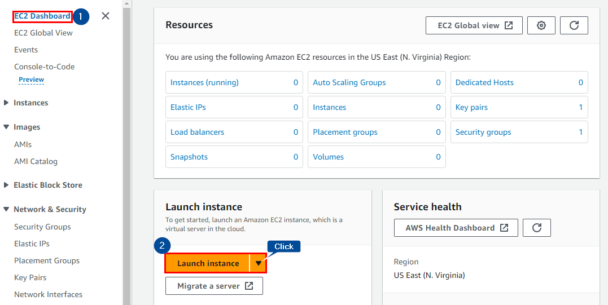
**2.2** Choose a suitable name for the value of Name and click the default setting for Amazon Machine image below. Select the OS images in this lab we will use Amazon linux AMi which is free tier eligible. Select the X64 architecture.
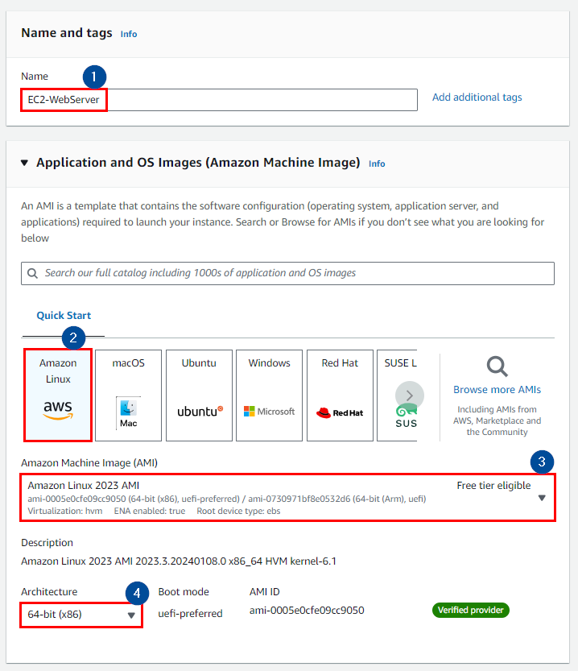
2.3 Select the T2 micro in the instance type family with 1vCPU and 1GiB memory. This is free tier eligible and just meet the purpose of this lab.
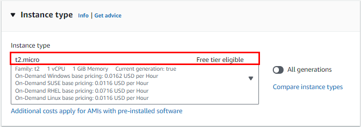
2.4 In the dropdown menu select the key pair that you created in the beginning of this lab.
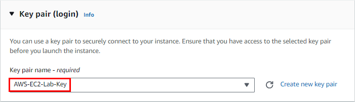
2.5 Click the Edit button in Network settings and set the address block where the EC2 will be located. 
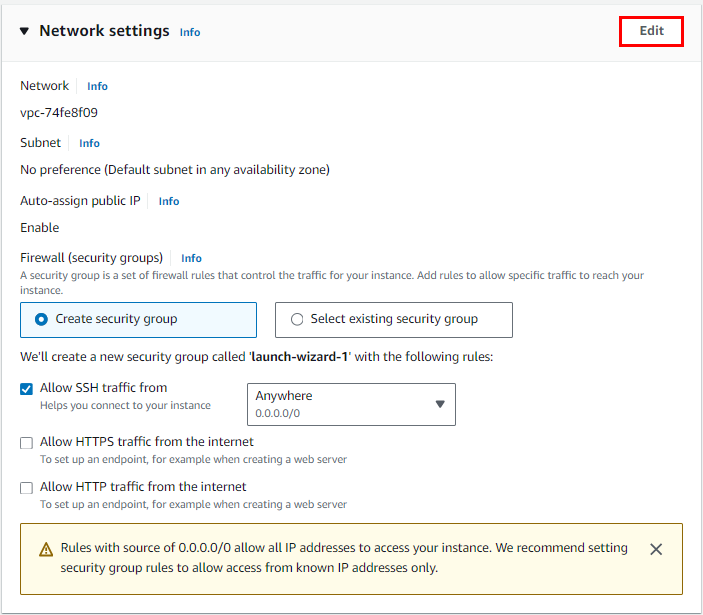
In the **Network Settings** configuration, Select **default** VPC and set the subnet to **No Preference**. **Auto-assign public IP** is set to **Enable**. Select  **Create Security Groups** next great a new security group to act as a network firewall. Security groups will specify the protocols and addresses you want to allow in your firewall policy. For the security group you are currently creating, this is the rule that applis to the EC2 that will be created. Aftere entering the Name of the security group and **Description**, select add Security Group rule and set HTTP to **Type**
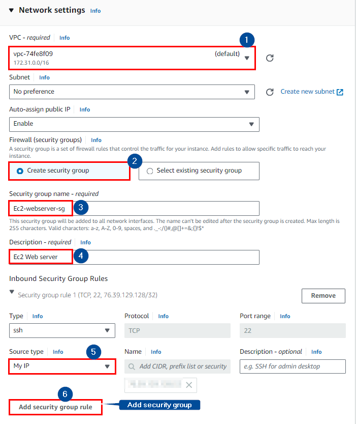
In this lab will allow SSH connectivity only from my public address alone. Also, allow TCP/50 for web service and select **My IP** as source.
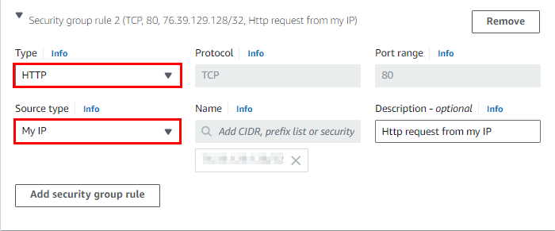
2.6 All other values accpt the default values, expand by clicking on the **Advanced Details** tab at the botton of the screen. 
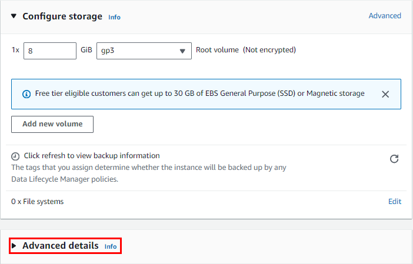
Click on Meta Data version dropdown and select V2 only (token required)
We will use the following **User data** fields and select **Launch instance**.
Step 3. Connect to EC2 Linux Instance.


````python
#!/bin/sh
​
#Install a LAMP stack
dnf install -y httpd wget php-fpm php-mysqli php-json php php-devel
dnf install -y mariadb105-server
dnf install -y httpd php-mbstring
​
#Start the web server
chkconfig httpd on
systemctl start httpd
​
#Install the web pages for our lab
if [ ! -f /var/www/html/immersion-day-app-php7.zip ]; then
   cd /var/www/html
   wget -O 'immersion-day-app-php7.zip' 'https://static.us-east-1.prod.workshops.aws/public/b8d66c76-0455-4d13-8acd-9002b999b537/assets/immersion-day-app-php7.zip'
   unzip immersion-day-app-php7.zip
fi
​
#Install the AWS SDK for PHP
if [ ! -f /var/www/html/aws.zip ]; then
   cd /var/www/html
   mkdir vendor
   cd vendor
   wget https://docs.aws.amazon.com/aws-sdk-php/v3/download/aws.zip
   unzip aws.zip
fi
​
# Update existing packages
dnf update -y
````
2.7 Click the **View Instances** button in the lower right hand portion of the screen to view the list of EC2 instances. Once your instance has launched, you will see your Web Server as well as the Availability Zone the instance is in, and the publicly routable **DNS name**. Click the checkbox next to your web server to view details about this EC2 instance.
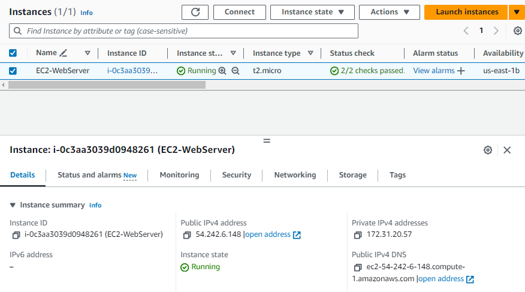

**Browse the Web Server**
Wait for the instance to pass the Status Checks to finish loading. Open a new browser tab and browse the Web Server by entering the EC2 instance’s Public DNS name into the browser. The EC2 instance’s **Public DNS name** can be found in the console by reviewing the **Public IPv4 DNS** name line highlighted above. You should see a website that looks like the following.

> If you are using the Chrome web browser, when you attach the Public **IPv4 DNS** value to the web browser, if it does not run, https may be automatically added in front of the DNS value, so it may not run. Therefore, it is recommended to enter http://.
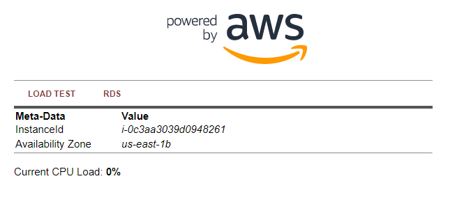


**Step 3. Connecting to EC2 Instance**
To connect to the Linux instance we will use an SSH client. For Windows users, go to the [Connecting To Your Linux Instance using PuTTy](https://catalog.workshops.aws/general-immersionday/en-US/basic-modules/10-ec2/ec2-linux/3-ec2/4-ec2) For Mac users, use the terminal.

3.1 In the EC2 instance console, select the instance you want to connect to, and then click the Connect button.
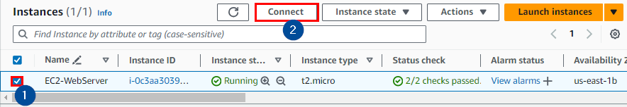
3.2 In the Connect to instance page, select SSH client. Follow the instructions below. Navigate to where your private key is located and change the permission of the key using the command specify in point 3 in the **connect to instance** window ie. ```console
chmod 400 "AWS-EC2-Lab-Key.pem"
```
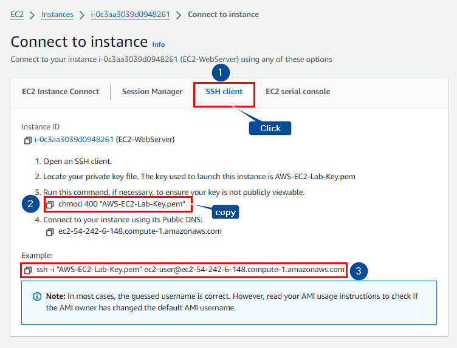
3.3 Next, enter the following command in your SSH client to connect to your Linux instance.
```console
ssh -i "AWS-EC2-Lab-Key.pem" ec2-user@ec2-54-242-6-148.compute-1.amazonaws.com
```
After connecting continue query to yes, and this will open up a connection to our EC2 linux instance.
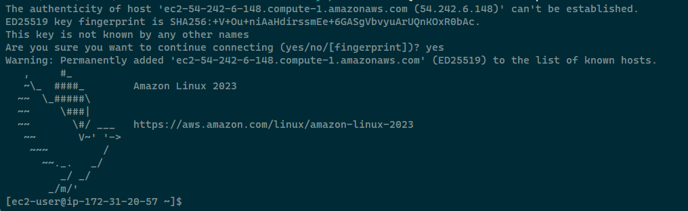

**Step 4. Cleaning up Resources**
To delete the EC2 instance you created, Select the instance that you created in this lab. From the Instance state menu, select **Terminate instance**.
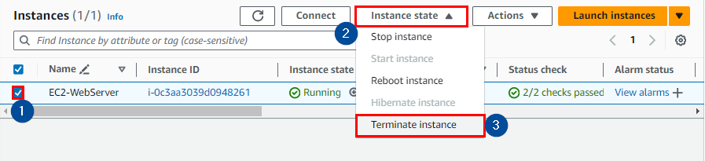
Confirm termination of the EC2 instance by clicking on the Terminate button at the button of the popup page.
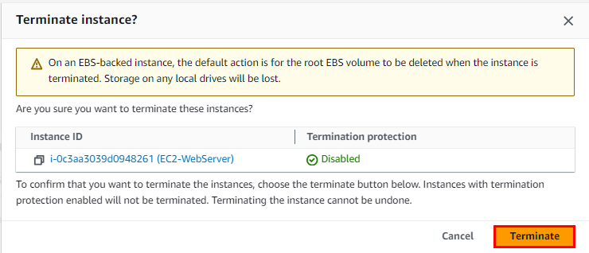