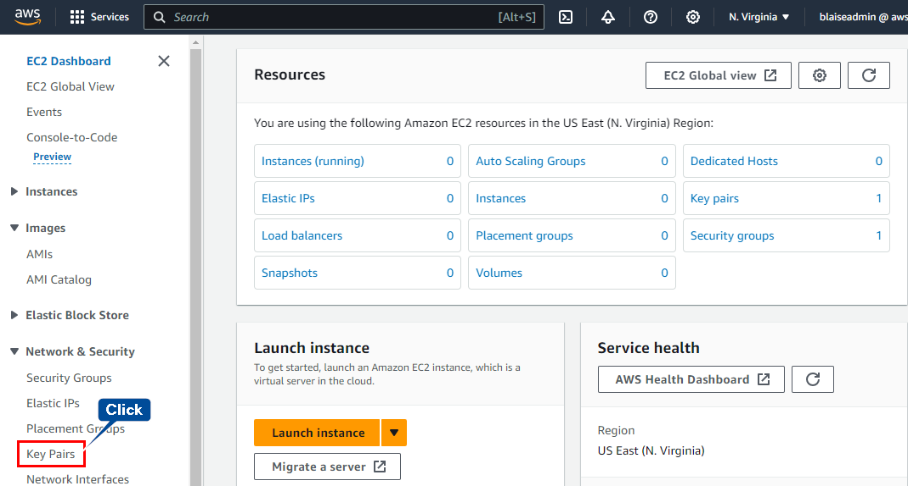
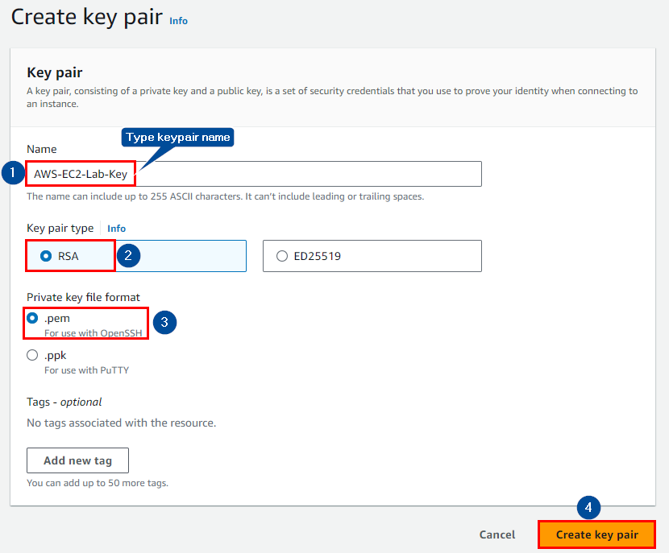
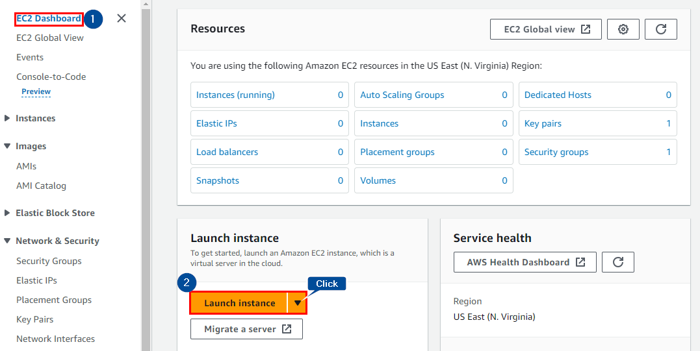
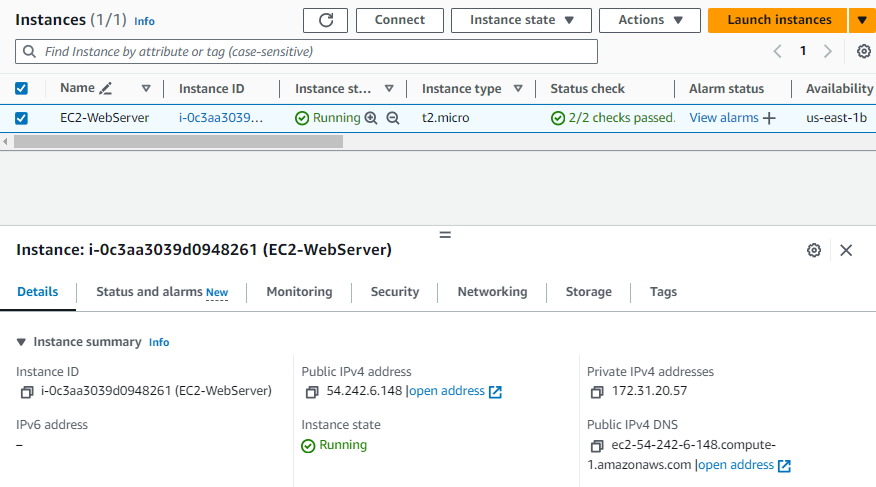
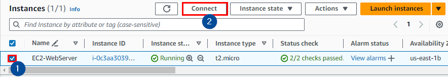
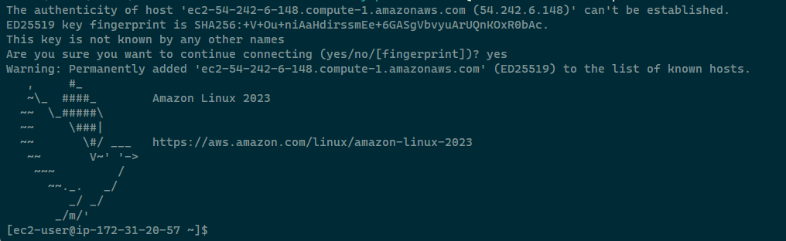

# Creating A EC2 webserver in AWS.

## Introduction
**Amazon EC2 Overview**
[Amazon EC2](https://docs.aws.amazon.com/AWSEC2/latest/UserGuide/concepts.html) provides scalable computing capacity in the Amazon Web Services (AWS) Cloud, offering a flexible and efficient solution for application development and deployment. By eliminating the need for upfront hardware investment, Amazon EC2 enables rapid development and deployment, allowing users to configure virtual servers, manage storage, and address security and networking requirements. The scalability of Amazon EC2 ensures efficient handling of changing demands, reducing the need for traffic forecasting.


**Prerequisites**
An active AWS account or IAM user account is required to explore Amazon EC2.

## Step 1: Create a New Key Pair
In this lab, creating an EC2 instance involves using an SSH key pair for secure remote login on port 22. Follow these steps to create a unique SSH key pair:

**1.1** Sign in to the AWS Management Console and open the [Amazon EC2 console](https://console.aws.amazon.com/ec2).

**1.2** Navigate to **Key Pairs** in the Network & Security section, and click **Create Key Pair**.



**1.3** Provide a name for the Key Pair, then click **Create Key Pair**. For Windows users, select ppk for file format and .pem for OpenSSH or Linux users.



**1.4** Download the generated file [Your private key Name].pem to your local drive. Remember the file's full path for future use.

## Step 2: Launch a Web Server Instance
Launch an Amazon Linux 2 instance, bootstrap Apache/PHP, and install a basic web page. Follow these steps:

**2.1** Click on **EC2 Dashboard**, then **Launch Instances**.



**2.2** Choose a suitable name, select Amazon Linux 2 as the OS image, and choose a T2 micro instance type.


**2.3** Select the T2 micro instance type, ensuring it is free tier eligible.


**2.4** Choose the key pair created earlier and configure network settings, security groups, and advanced details.


**2.5** Set up the security group to allow SSH connectivity and web service (TCP/80).


**2.6** Accept default values, click on the **Advanced Details** tab, and paste the provided User Data script.


**2.7** Click **Launch Instance** and view instances to check the status.



**Browse the Web Server**
Wait for the instance to pass the status checks and browse the web server by entering the EC2 instance’s Public DNS name into the browser.


## Step 3: Connecting to EC2 Linux Instance
Connect to the Linux instance using an SSH client. Follow these steps:

**3.1** In the EC2 console, select the instance, click **Connect**, and follow the instructions.



**3.2** In your SSH client, connect to the Linux instance using the provided command.

```console
ssh -i "AWS-EC2-Lab-Key.pem" ec2-user@ec2-54-242-6-148.compute-1.amazonaws.com
```



## Step 4: Cleaning Up Resources
To delete the EC2 instance, select it and choose **Terminate instance** from the Instance state menu.


Confirm the termination to clean up resources effectively.


This comprehensive guide empowers you to harness the full potential of Amazon EC2 for your cloud computing needs. Happy cloud computing!